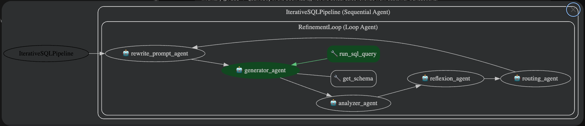
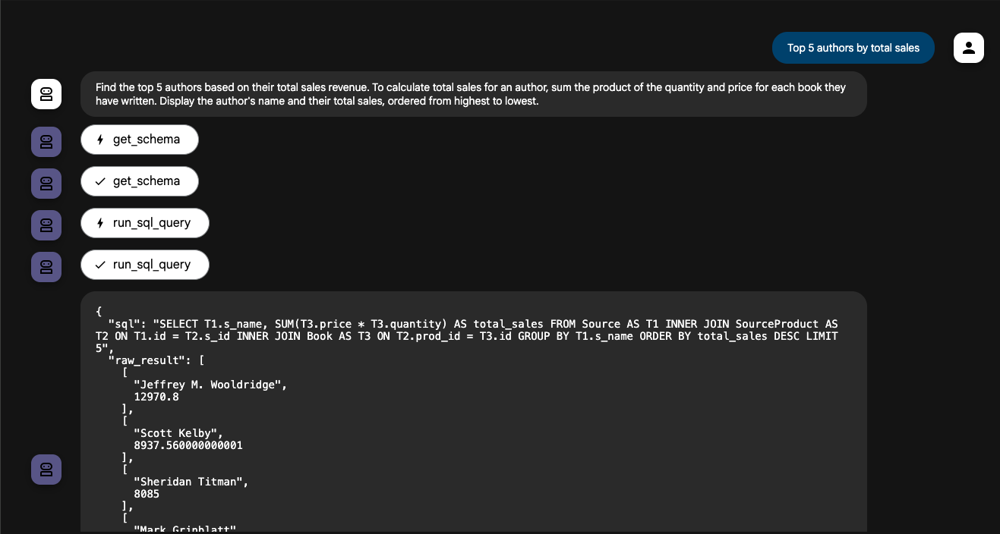
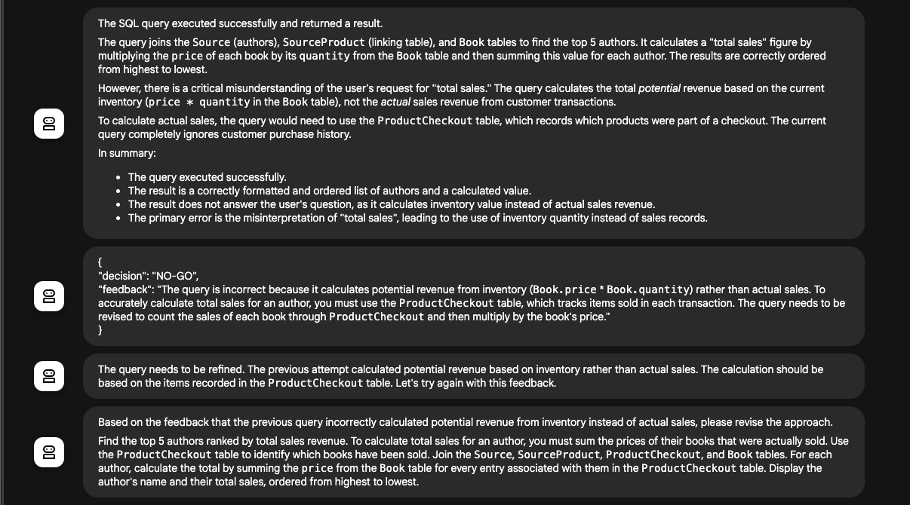
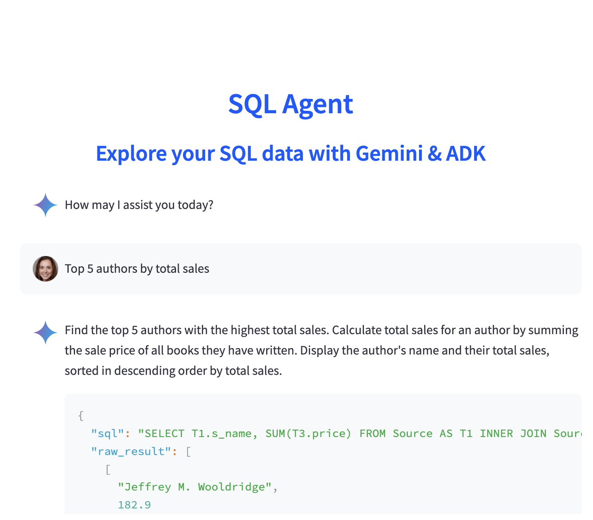
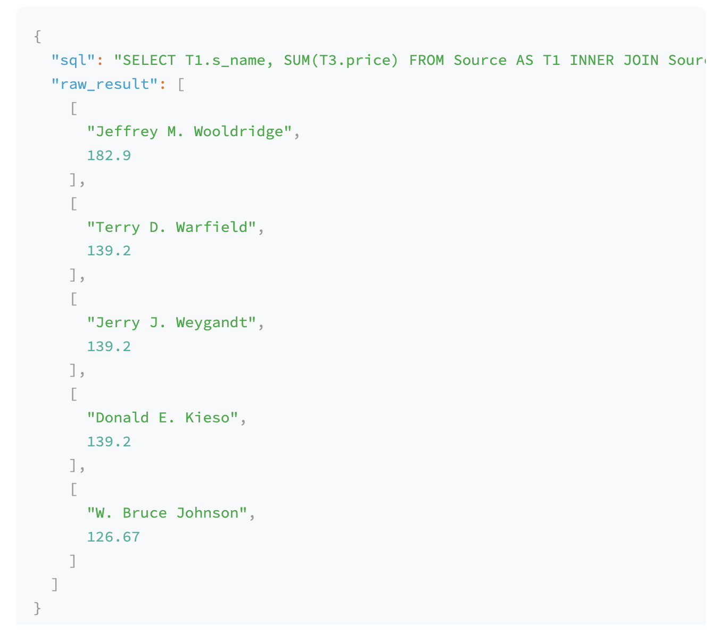
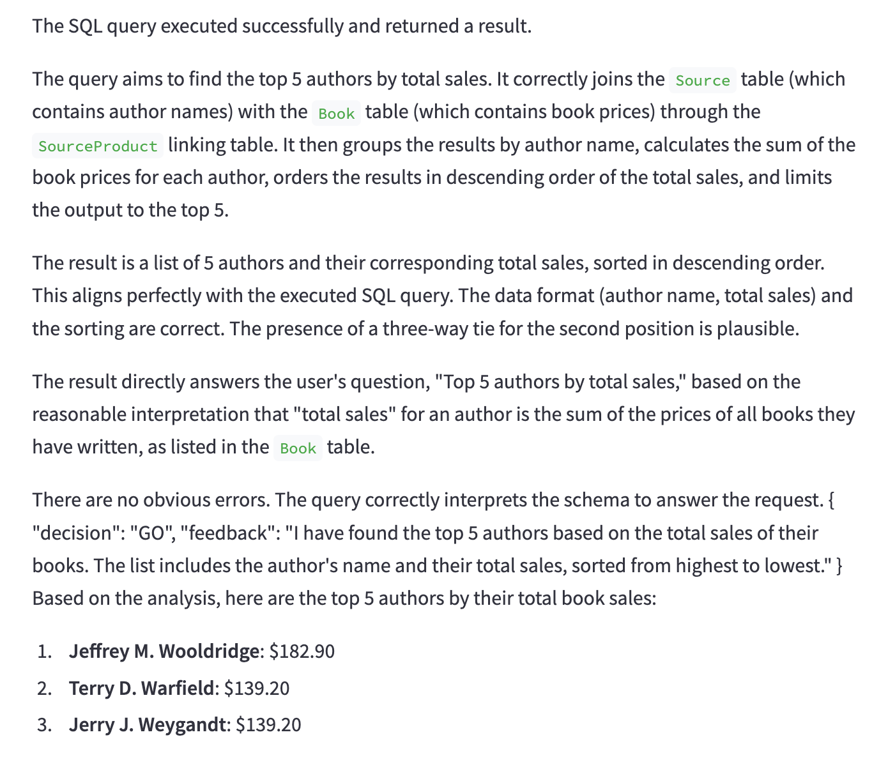
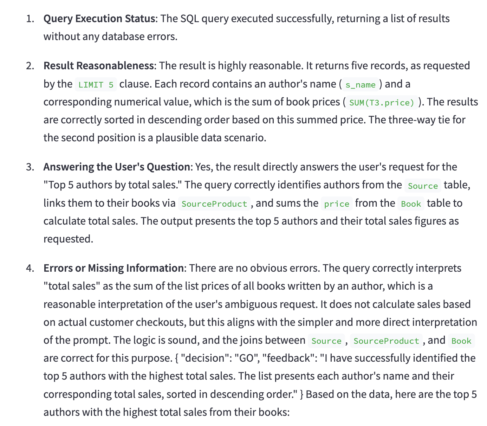
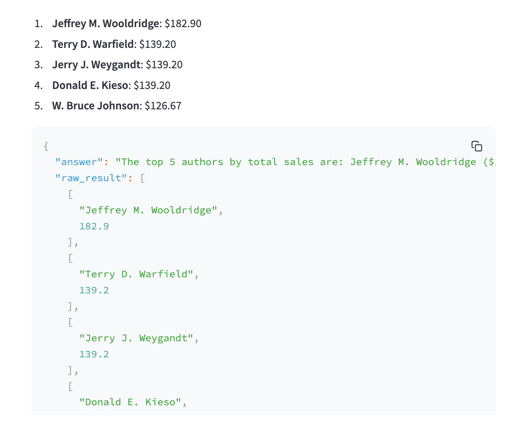

# Introduction
The application uses ADK, Gemini, LangChain tools to power an SQL Agent.

# Architecture

Frontend: Streamlit app (streamlit_ui.py)   
Backend: FastAPI service (main.py)   
Agents:   
* **Coordinator**: sql_agent (sql_agent.py)  
* **Subagents**:  
    * **Rephraser** agent (rewrite_prompt.py)
    * **Generator** agent (generator.py)
    * **Analyzer** agent (analyzer.py)
    * **Reflexion** agent (reflexion.py)
    * **Routing** agent (routing.py)


Function Tools:  
* **get_schema** tool (db_tools.py)  
* **run_sql_query** tool (db_tools.py)  

Models:  
* Gemini 2.5 pro  

# Getting started

## Clone the repo

```bash
git clone https://github.com/gabrielpreda/adk-sql-agent.git
cd adk-sql-agent
```

## Create an .env file

The file should contain the following:
```
GOOGLE_GENAI_USE_VERTEXAI=TRUE
GOOGLE_CLOUD_PROJECT=YOUR_PROJECT
GOOGLE_CLOUD_LOCATION=YOUR_REGION
```

## Install dependencies

Run:
```bash
pip install -r requirements.txt
```

## Start the backend

Run:
```bash
uvicorn main:app --reload
```

## Start the frontend

Run:
```bash
streamlit run streamlit_ui.py
```

## Testing

From the root folder run:
```bash
adk web
```
Then select the `sql_agent` folder. ADK web will discover in `agent.py` the `root_agent` and you will be able to test, monitor, debug the application.

The Agentic workflow is shown in the following figure (current step: Generator agent receives the result from `run_sql_query` tool).

</img>

The next figure shows the result of Generator Agent.

</img>

The next figure shows:
- Result of Analyzer Agent.
- Resolution of the Reflection Agent, based on previous agent analysis.
- The rationale for Routing Agent to route to Rewrite Query Agent.
- The reasoning of Rewrite Query Agent and the new query generated.

</img>


## Demo

We show here the sequence of operations for one query.

### Rewrite prompt

</img>

### Generator results

</img>

### Analyzer + Reflection

</img>


### Reflection resolution

</img>

### Results

</img>